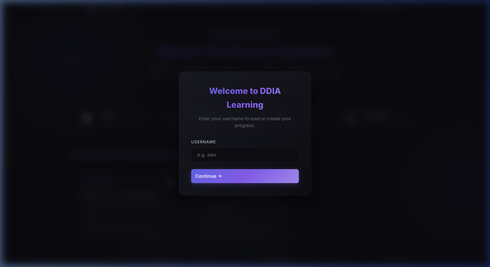
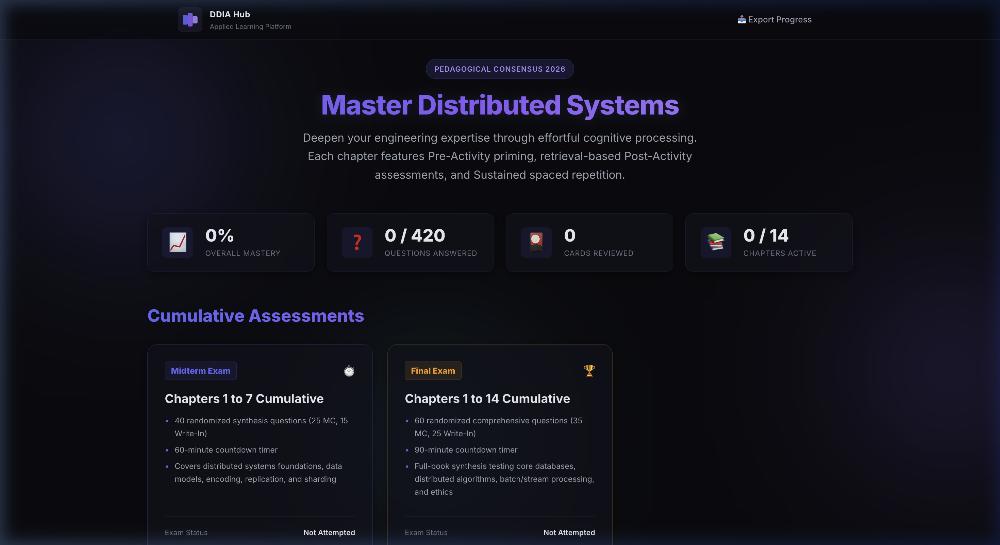

# Interactive Workbook for Designing Data-Intensive Applications

*No association with the author or publisher. This is a site I built for my own learning.* 

An interactive, evidence-based learning platform tailored to Martin Kleppmann's *Designing Data-Intensive Applications*. The platform implements the **2026 pedagogical consensus on learning science**, shifting learning from passive reading to effortful cognitive processing, retrieval practice, and spaced repetition.



---

## Core Features

### 1. Chapter-by-Chapter Practice (Chapters 1 to 14)
Each chapter folder hosts an independent web application implementing three research-backed learning phases:
- **Phase 1: Pre-Activity (Prime)**
  - *Confidence Diagnostics*: Sliders to assess baseline confidence on key chapter topics.
  - *Architecture Design Puzzle*: A complex, open-ended scenario where the student designs a system *before* reading the content (ABC Pedagogy).
  - *Misconception Detector*: Provocative statements that target common beginner misconceptions, providing immediate corrective feedback.
- **Phase 2: Post-Activity (Retrieve)**
  - *Timed Brain Dump*: A 5-minute timed recall area to perform free-recall consolidation immediately after reading.
  - *30-Question Interleaved Quiz*: Exactly 30 questions (18 multiple choice, 12 write-ins) interleaving different chapter sub-sections to build categorization strength.
  - *Inline AI Grading*: Grade write-ins instantly via a local Flask server connected to the Gemini API. 1-5 scores and tutor reviews are saved and displayed inline.
  - *LLM Exporter*: Export write-in answers alongside canonical rubrics to copy/paste into external LLM interfaces if desired.
- **Phase 3: Sustained Practice (Retain)**
  - *Spaced Repetition Calendar*: An 8-step review schedule using expanding intervals (Today, +1d, +3d, +1w, +2w, +1m).
  - *Self-Rated Flashcards*: 12–15 flashcards with self-rating buttons (1-4 scale) to track memory strength.
  - *Interleaved Scenarios*: Cross-topic application challenges ending with a "Trade-off Tribunal" where the student argues both sides.
  - *Forgetting Curve Canvas*: An interactive HTML5 Canvas displaying memory decay over time, spiked by spaced review events.

### 2. Timed Cumulative Exams
- **Midterm Exam (Chapters 1 to 7)**: Selects a randomized pool of 40 questions (25 Multiple Choice, 15 Write-In) from the 210 questions in Ch 1-7. Starts a 60-minute countdown.
- **Final Exam (Chapters 1 to 14)**: Selects a randomized pool of 60 questions (35 Multiple Choice, 25 Write-In) from all 420 questions. Starts a 90-minute countdown.
- **Exam Testing UI**: Sticky sidebar with a ticking timer, progress meter, flagged status checkbox, and a grid question-number map (green for answered, yellow for flagged, outline for current).
- **Deferred Evaluation**: Feedback is deferred; scores, correct/wrong selections, explanations, and model answers are only revealed after the exam is submitted.
- **One-Click AI Grading**: Grade all exam write-in questions in one click. Displays the average score directly in the results modal and renders strengths, weaknesses, and tutor guidance inline when reviewing questions.



### 3. Integrated Dashboard Landing Page
- Serves as the central navigation hub.
- Displays aggregate metrics dynamically computed from the browser SQLite database (`db.js` / WASM):
  - *Overall Mastery*: The average score percentage across all chapters.
  - *Questions Answered*: The aggregate count of answered questions (out of 420 total).
  - *Cards Reviewed*: Total cards rated across all learning sessions.
  - *Chapters Active*: Total chapters where activities have commenced.
  - *Exam Statuses*: High scores and progress states for Midterm and Final Exams.

---

## Directory Structure

```
/ddia
├── /chapters/             # Source HTML files of the book chapters
├── /learning-app/         # Core application directory
│   ├── /ch01/ to /ch14/   # Sub-apps for Chapters 1-14 (index.html, app.js)
│   ├── /exams/            # Exams engine (index.html, exam.js)
│   ├── index.html         # Main Dashboard Landing Hub
│   └── styles.css         # Consolidated design system stylesheet
├── README.md              # This documentation file
└── split_epub.py          # Utility script
```

---

## How to Run Locally

The application runs a Flask-based backend server that supports serving static files and handling interactive AI grading features.

To start the server, execute the launch script from the root directory:

```bash
# Launch the web app on default port 8080
./launch.sh

# Or start it on a custom port (e.g., 8085)
./launch.sh 8085
```

### Accessing the Site
The launch script will automatically open the platform in your browser, or you can navigate directly to:
👉 http://localhost:8080/index.html

---

## Environment Configuration (.env)

To enable live AI grading (either inline from the browser or using the command-line grading script), you need to configure your Gemini API Key and optionally select a Gemini model.

1. Create a `.env` file in the project root:
   ```bash
   touch .env
   ```
2. Open `.env` and add your settings:
   ```env
   GEMINI_KEY="foo..."
   GEMINI_MODEL="gemini-3.5-flash"
   ```
   - **`GEMINI_KEY`**: Your Gemini API Key (required for AI grading).
   - **`GEMINI_MODEL`**: The Gemini model to use (defaults to `gemini-3.5-flash` if not specified).
   
   *Note: Enclosing quotes (single or double) and trailing whitespace are automatically stripped from these values to prevent connection errors.*

---

## Automated AI Grading (CLI)

You can run automated grading of your answers directly from the terminal. The `grade.sh` helper script will automatically set up a Python virtual environment, install dependencies, and execute the grader.

1. **Export Progress**: Click **📥 Export Progress** in the browser app header and save the `ddia_progress.json` file in the project root directory.
2. **Run the Grader**:
   ```bash
   # Run AI grading using default parameters (uses GEMINI_MODEL from .env)
   ./grade.sh
   
   # Or run with a custom model override (e.g. gemini-1.5-pro)
   ./grade.sh grade --model gemini-1.5-pro
   
   # Or run with optional parameters (e.g. custom output report file)
   ./grade.sh grade --output my_grades_report.md
   ```

The script queries the configured Gemini model to grade answers (1-5 scale) against the model rubrics and outputs a detailed markdown feedback report (default: `ddia_grades_report.md`).

---

## Resetting the Database

If you want to clear your local progress files, exported databases, and grader log history to start from a completely fresh database condition, run:

```bash
./reset_database
```

This clears `ddia_progress.json`, deletes any exported `ddia_progress.db` files, removes `ddia_grades_report.md`, and empties the log files inside the `logs/` directory.

---

## Development & AI Disclosure

This codebase was generated using agentic AI coding assistants (colloquially known as "vibe coding") under human direction. 

Additionally, the platform uses Generative AI to grade open-ended responses. Please verify AI-generated feedback against the textbook.

---

## License

This project is licensed under the MIT License - see the LICENSE file for details.


